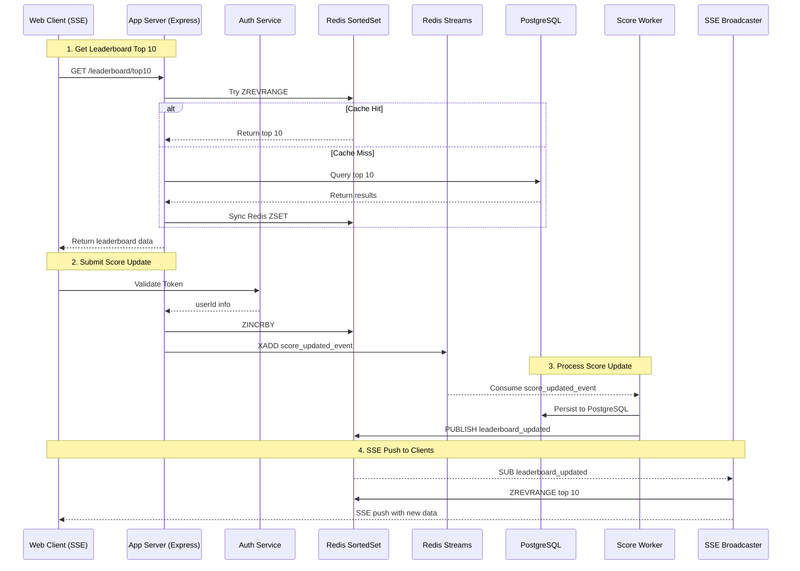

# 📈 Scoreboard API Module Specification

## 1. Overview

This component implements a live-scoring mechanism with top 10 tracking, secure score updates, and SSE-based broadcasting to all subscribed clients.

## 2. Functional Requirements

- The scoreboard displays the top 10 users with the highest scores.
- When a user performs a predefined action, their score should increase.
- The score update should be securely handled through a backend API.
- The scoreboard must support real-time updates to reflect latest scores.

## 3. Non-Functional Requirements

- **Security**: Prevent unauthorized or forged API calls from increasing a user's score.
- **Performance**: The system should handle high frequency of score update requests and real-time read access efficiently.
- **Scalability**: Support thousands of concurrent users.
- **Maintainability**: Modular code with clear documentation and test coverage.
- **Availability**: System should be resilient to failures, with high uptime.

## 4. High-Level Architecture

![High Level Design]https://raw.githubusercontent.com/thetran-zalora/code-challenge/refs/heads/thetran-backend/src/problem6/high-level-design.drawio.svg)

| Component                     | Main Role                                                                                         |
|------------------------------|----------------------------------------------------------------------------------------------------|
| **Client (Web/Game)**        | Sends score increment requests (`POST /api/score`), opens SSE connection to receive updates       |
| **API Gateway**              | Routes requests                                                                                    |
| **Auth Service**             | Verifies user identity (JWT, OAuth token, session cookie), provides user context to API Gateway or Backend |
| **App Server (Backend)**     | Handles score update logic, protects against tampering                                            |
| **Redis Sorted Set**         | Maintains leaderboard scores (`ZINCRBY`, `ZREVRANGE`), used as fast-access cache for top users     |
| **Redis Streams**            | Acts as an event bus for score update events, enables decoupled processing |
| **Leaderboard Notifier**     | Subscribes to Redis Pub/Sub → Fetches leaderboard from Redis ZSET → Sends real-time updates to clients |
| **PostgreSQL**               | Stores audit logs, persistent user scores, detects cheating, handles long-term recovery            |
| **Background Worker (Queue)**| Consumes Redis Streams → Validates and persists score updates to DB|

## 5. Sequence diagram.

